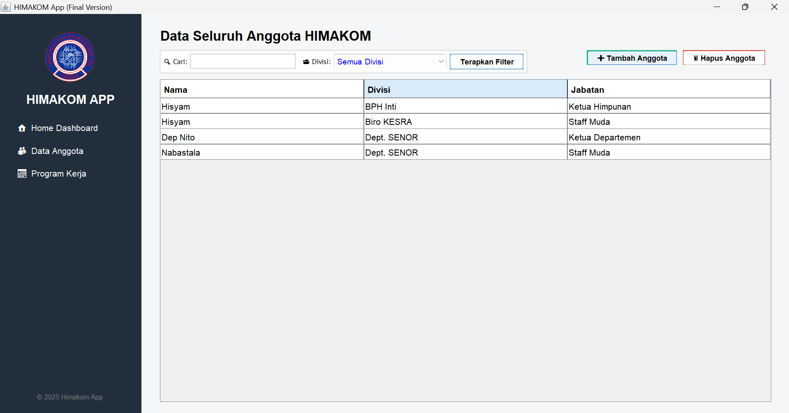
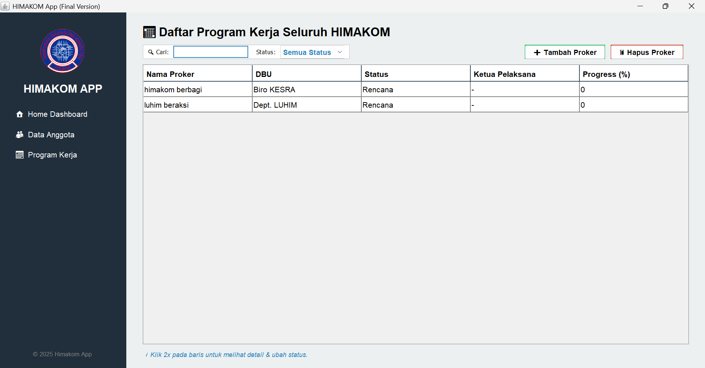

# Campus Organization Manager

<p align="center">
	
</p>

**Kelompok:** LIANG TA 2027

**Anggota:**
- Ersya Hasby Satria — 241511072
- Muhammad Brata Hadinata — 241511082
- Varian Abidarma Syuhada — 241511091

Aplikasi desktop Java untuk mengelola struktur organisasi kampus (divisi, anggota, dan program kerja) dengan arsitektur rapi, desain modern, serta praktik clean code yang diaudit melalui SonarQube/SonarLint.

## Deskripsi Singkat
- Aplikasi ini membantu pengurus organisasi kampus memetakan struktur (BPH, biro, departemen), mengelola data anggota (jabatan, perpanjangan/delegasi, kas), dan memantau program kerja (status, progres, ketupel/waketupel, deskripsi).
- UI berbasis Swing dengan pola navigasi `CardLayout`, tabel interaktif, pencarian real-time, dan filter yang non-destruktif.

## Latar Belakang
- Banyak organisasi kampus membutuhkan alat sederhana namun tegas untuk konsolidasi data anggota dan proker tanpa bergantung pada spreadsheet manual.
- Proyek ini dirancang sebagai studi kasus rekayasa perangkat lunak tingkat awal–menengah yang menekankan penerapan desain pola, pengujian, dan kualitas kode yang dapat diinspeksi otomatis.

## Poin-Poin Penilaian (Fitur Teknis)
- 4 Design Pattern (terimplementasi di package `com.campusorg.patterns`):
	- Singleton: `OrgManager` sebagai state global terkontrol (holder pattern) untuk akses struktur organisasi dan publisher berita.
	- Composite: `Division`, `Member`, dan `OrgComponent` untuk merepresentasikan tree organisasi yang dapat ditraversal secara rekursif.
	- Factory: `MemberFactory` untuk membuat berbagai tipe anggota (Staff Muda/Ahli, Pejabat Struktural) dari parameter GUI.
	- Observer: `NewsPublisher` untuk broadcast notifikasi/berita ke anggota yang berlangganan.
- Clean Code dengan SonarQube/SonarLint:
	- Deduplikasi literal (font, status, key JSON) melalui `com.campusorg.utils.Constants`.
	- Penggantian `System.out/err` dengan `java.util.logging.Logger` di lapisan data.
	- Pemakaian `switch expression`, pattern matching `instanceof`, dan guard pattern untuk kode yang ringkas dan aman.
	- Warning Sonar yang tidak relevan ditangani dengan refactor atau `@SuppressWarnings` berkomentar (mis. penggunaan Singleton yang sadar konteks).
- Generic Programming:
	- Penggunaan koleksi generik (`Map<String, Division>`, `List<OrgComponent>`) dan API generik seperti `TableRowSorter<DefaultTableModel>` + `RowFilter`.
- Java Collection Framework:
	- Struktur data: `LinkedHashMap` untuk peta divisi (preservasi urutan), `ArrayList` untuk daftar dan traversal anggota/proker.
	- Operasi map/filter pada tabel menggunakan `RowFilter` untuk pencarian dan penyaringan non-destruktif.
- JUnit (Testing):
	- Unit-test tersedia di `src/test/java` (mis. `MemberFactoryTest`, `NewsPublisherTest`, `OrgManagerTest`, `CompositePatternTest`).
	- Mendukung verifikasi fungsional komponen inti dan regresi sederhana.
- Exception Handling:
	- Penanganan IO dengan try-with-resources dan logging; fallback data default saat file tidak tersedia; input kas/divisi/proker divalidasi dengan penghindaran crash.

## Cara Menjalankan
```powershell
# Build
mvn -f "campus-organization-manager/pom.xml" clean package

# Menjalankan aplikasi
mvn -f "campus-organization-manager/pom.xml" exec:java

# Menjalankan unit test
mvn -f "campus-organization-manager/pom.xml" test
```

## Sorotan UX
- Pencarian real-time untuk data anggota dan program kerja.
- Filter divisi (DBU) & status proker yang tidak menghapus data tabel (menggunakan sorter).
- Detail proker dengan perubahan status (cycle), progres bar, dan form edit ringan.

## Galeri
<p>
	
</p>
<p>
	
</p>
<p>
	
</p>

## Struktur Proyek Ringkas
```
campus-organization-manager/
	├─ src/main/java/com/campusorg/
	│  ├─ app/             # Entry point
	│  ├─ database/        # DataStore + JSON (Gson)
	│  ├─ gui/             # Swing UI (MainFrame, Panels)
	│  ├─ models/          # Model Proker
	│  ├─ patterns/        # composite, factory, observer, singleton
	│  └─ utils/           # Constants
	└─ src/test/java/      # JUnit tests
```

## Catatan Kualitas Kode
- Projek divalidasi dengan SonarLint di IDE; sebagian rule diatasi melalui refactor dan sebagian kecil dengan `@SuppressWarnings` yang terdokumentasi.
- Fokus pada keterbacaan, konsistensi, dan minim side-effects saat filtering/pencarian.

## Lisensi
- Proyek tugas/latihan akademik. Gunakan bebas untuk pembelajaran.